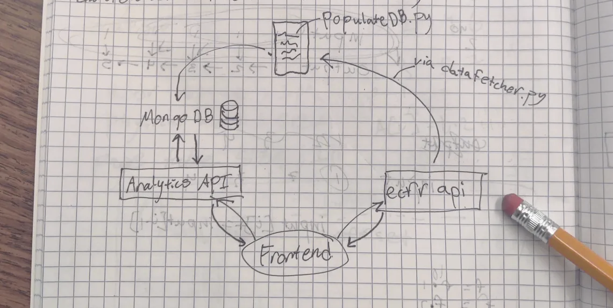

# Project map 

# eCFR Database Model

#### Collection Structure

- **ecfr/**
  - **agencies/** – Stores government agency meta-data
  - **fs.chunks/** – GridFS chunks for titles XML 
  - **fs.files/** – GridFS metadata for files
  - **title_revisions/** – Historical modifications to CFR titles
  - **titles/** – Regulatory text and metadata
#### Data Models 

**agencies**
- _id
- name
- short_name
- display_name
- sortable_name
- slug
- children
- cfr_references
  - title
  - chapter

**title_revisions**
- _id
- title_number
- title_name
- changes_per_year
  - year as key
  - number of changes as value

**titles**
- _id
- number
- name
- latest_amended_on
- latest_issue_date
- up_to_date_as_of
- reserved
- xml_content
  - gridfs_id
- word_count

#### Run instructions
- first run `python populateDB.py`
- to start backend: `uvicorn api:app --host 0.0.0.0 --port 8000 --reload`
